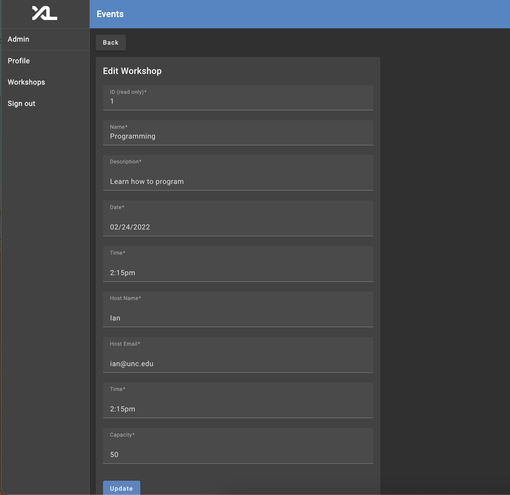

# Workshops Documentation

## Authors 
* Aubry Dreikosen - https://github.com/aubrydreikosen
* Elaine Dong - https://github.com/elaine331917 
* Ian Washabaugh - https://github.com/ianwash 
* Megan Nickel - https://github.com/megansyd

## Overview

This feature is designed to showcase upcoming computer science workshops and allow students to sign up for them. These workshops will provide students with the ability to expand their knowledge and practical experience in computer science and related fields.

It will primarily serve students interested in computer science and technology, whether they are a computer science major or a non-major who wants to learn more about programming.

This feature will provide students with access to additional educational resources beyond classes, allowing them to develop their skills and expand their knowledge in a practical setting. Workshops can also provide opportunities for networking as students will get to interact with other like-minded individuals. Students will also be allowed to share their knowledge by hosting workshops on topics they have expertise in.

At a high level, this feature contains the following functions:

* List upcoming workshops: list upcoming workshops, including title, date, time, and capacity


* Workshop details: show individual information about each workshop including a description, the host's name and contact information.

* Workshop registration and deregistration: allow students to sign up for workshops and also cancel their sign up

* Workshop creation, deletion, and editing: allow admins to create, delete, and edit workshops





## Implementation Notes
In order to implement this feature, we have introduced an event entity which represents the workshop in question. Please see the code snippet below to see the fields in which the workshop has been created with.

```
class EventEntity(EntityBase):
    __tablename__ = 'event'

    id: Mapped[int] = mapped_column(Integer, primary_key=True)

    name: Mapped[str] = mapped_column(
        String(64), nullable=False, default='')
    
    description: Mapped[str] = mapped_column(
        String(64), nullable=False, default='')
    
    date: Mapped[str] = mapped_column(String(64), nullable=False, default='')

    time: Mapped[str] = mapped_column(String(64), nullable=False, default='')

    capacity: Mapped[int] = mapped_column(Integer, nullable=False, default='')

    host_name: Mapped[str] = mapped_column(
        String(64), nullable=False, default='')
    
    host_email: Mapped[str] = mapped_column(
        String(64), nullable=False, default='')

    users: Mapped[list['UserEntity']] = relationship(secondary=user_event_table, back_populates='events')
```
If you were to implement additional fields within the workshop, the entity would be the place to begin refactoring. 

In addition to this, we altered the existing user entity to contain information about the events that they have registered for. We decided to utilize subclasses for each of these entities since we wanted our events to have users, and our users to have events. That way, it could easily be seen who had registered and the events that each user had signed up for. Therefore, we have an EventDetails subclass and a UserDetails subclass that contains this information to avoid any circular references within the database. These can be accessed when the specific information is needed. Please see the code snippet below for an example. 

This shows how to extend the User Model to contain more details: 
```
class UserDetails(User, NewUser):
    events: list['Event'] = []
```
And this shows how to alter the entity:
```
class UserEntity(EntityBase):
    __tablename__ = 'user'

    id: Mapped[int] = mapped_column(Integer, primary_key=True)
    pid: Mapped[int] = mapped_column(Integer, unique=True, index=True)
    onyen: Mapped[str] = mapped_column(String(32), unique=True, index=True)
    email: Mapped[str] = mapped_column(
        String(32), unique=True, index=True, nullable=False, default=''
    )
    first_name: Mapped[str] = mapped_column(
        String(64), nullable=False, default='')
    last_name: Mapped[str] = mapped_column(
        String(64), nullable=False, default='')
    pronouns: Mapped[str] = mapped_column(
        String(32), nullable=False, default='')
    roles: Mapped[list['RoleEntity']] = relationship(secondary=user_role_table, back_populates='users')
    permissions: Mapped['PermissionEntity'] = relationship(back_populates='user')
    events: Mapped[list['EventEntity']] = relationship(secondary=user_event_table, back_populates='users')
```

In addtion to these entities, we have configured an intermediary table between the users and events to automatically update each when the other is changed. Therefore, it isn't necessary to alter both of these entities to see changes in both; only one is needed. In order to introduce a similiar feature, it would be necesary to understand the code below as an example.

```
user_event_table = Table(
    "user_event",
    EntityBase.metadata,
    Column('user_id', ForeignKey('user.id'), primary_key=True),
    Column('event_id', ForeignKey('event.id'), primary_key=True)
)
```

`Note:` We decided to name our entity event instead of workshop because we could see this application growing in the future to be inclusive of other events that wouldn't necessarily be categorized as workshops--like company meet and greets, resume reviews, mock interview sessions. Therefore, in order to future proof our work, we made this change in advance. 

## Development Concerns

In order to get started on the backend, it is necessary to look at the backend folder and navigate to the entities and models folders. The models are how we defined different parts of our application, helping design the overall structure of the data we want to display. On the other hand, the entities define the constrains and relationships we want to have between our data, as well as providing the necessary functions to switch between this and the model. In order to alter the underlying database and scope of the application, these files should be where to start.

In terms of introducing functions to alter the database, the services folder would be the right place to start. Each model has their own service layer which has functions which alter or fetch data from the database. Once these are made, API endpoints can be made in the api folder, corresponding to the model as well. There is a seperate folder labeled 'admin' for admin endpoints that require a user to have specific permissions. From here, the endpoints and services can be tested using the /docs route in the localhost of which the application is running. 

Further testing for these services should be introduced in the test folder.

In order to get started on the frontend, it is necessary to understand the links included in the navigation component. A user can view their profile, as well as view a list of available workshops (workshops component). From the workshops component they can choose to "learn more" about any given workshop (via the workshop-details component), which includes the list of attendees. The workshops component relies on the workshops service to display workshops and the register service to register users for workshops. The workshops component displays all workshops as well as the workshops that the user is registered for. 

Admin have additional functionality; they will be able to navigate to the admin tab from the navigation component, where they can view a list of users, roles, and workshops. From here, they have the ability to add, edit, and delete workshops. Vital components to this functionality include the admin component and the edit-event component. 

## Future Work
If we had more time, we would create some form for students/others to submit workshop ideas which an admin could approve and create all in the application. However, this idea grew more complicated in terms of the database and underlying models. We thought it would be best to focus on the more important aspects of our project, offering up the temporary solution of a google form instead. 
